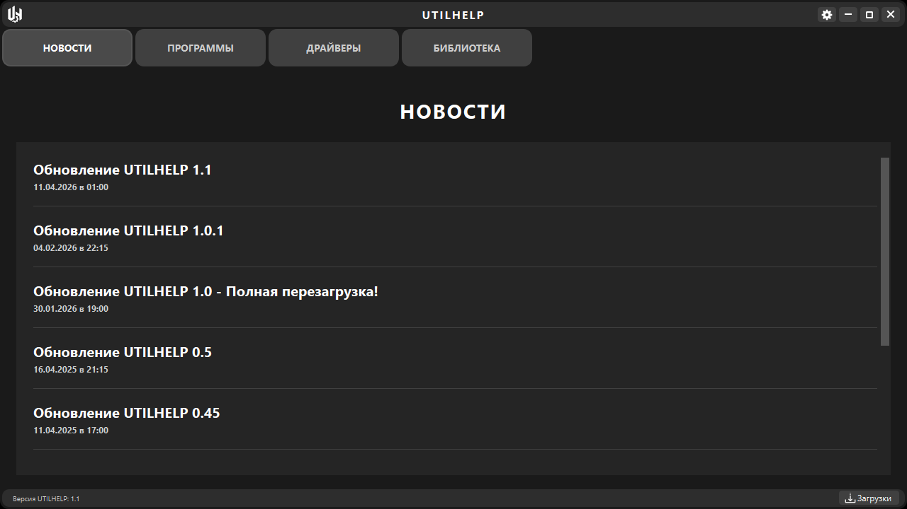
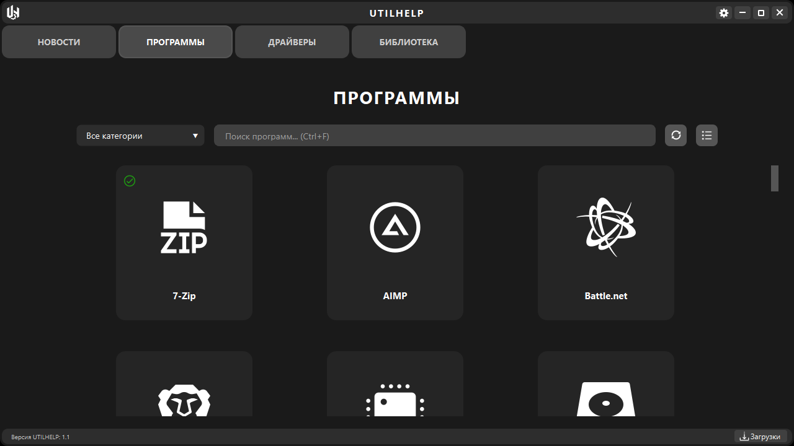
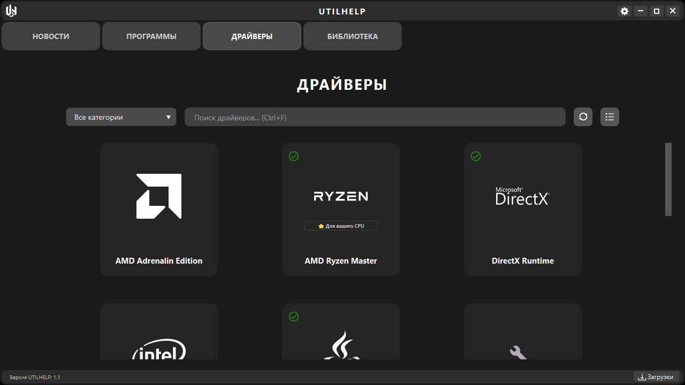
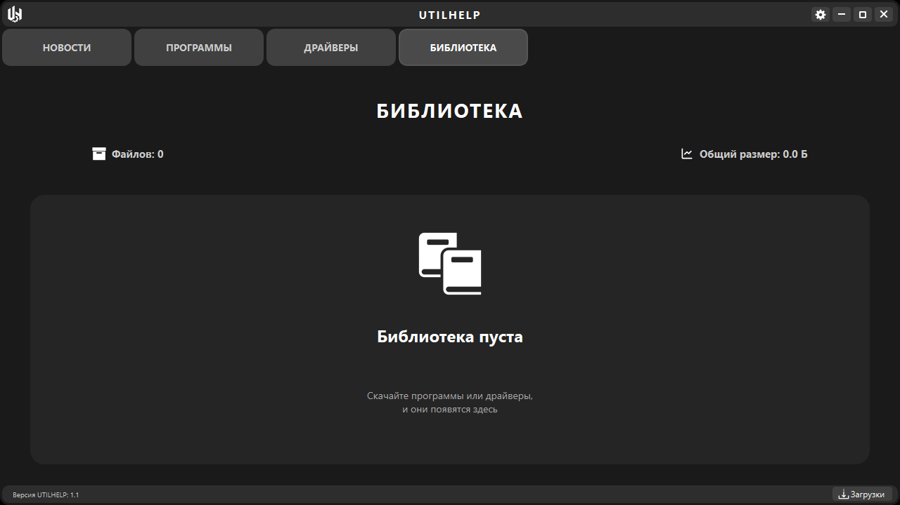

# 🛠️ UTILHELP

<div align="center">


**Универсальный помощник для Windows**

*Удобная программа для загрузки популярных программ, драйверов и других утилит*

[](https://www.microsoft.com/windows)
[](https://www.python.org/)
[](https://www.qt.io/)
[](LICENSE)

[](https://github.com/al1ster13/UTILHELP/releases)
[](https://github.com/al1ster13/UTILHELP/stargazers)
[](https://github.com/al1ster13/UTILHELP/issues)

[📥 Скачать последнюю версию](../../releases/latest) • [📖 Документация](../../wiki) • [🐛 Сообщить об ошибке](../../issues/new?template=bug_report.md) • [💡 Предложить идею](../../issues/new?template=feature_request.md)

</div>

---

## 🌟 Основные возможности

<table>
<tr>
<td width="50%">

### 📦 **Менеджер программ**
- 🎯 **20+ популярные программы** готовых к загрузке
- 🚀 **Быстрая загрузка** с официальных сайтов  
- 🎨 **Красивые иконки** для каждой программы
- ✅ **Автоматическое сканирование** установленного ПО
- ♥ **Система избранного** для часто используемых программ

### 🔧 **Менеджер драйверов**  
- 🎮 **GPU драйверы**: NVIDIA GeForce, AMD Adrenalin
- 🖥️ **CPU драйверы**: Intel Assistant, AMD Ryzen Master
- 📚 **Системные библиотеки**: DirectX, .NET, Visual C++, Java и другие
- 🔍 **Умное определение** установленных драйверов
- ⚡ **Фоновое сканирование** каждые 30 минут

</td>
<td width="50%">

### 📰 **Новости проекта**
- 📋 **История обновлений** UTILHELP
- 📝 **Changelog** всех версий 
- ✨ **Информация о новых функциях**
- 🎯 **Планы развития** проекта

### 📚 **Библиотека загрузок**
- 💾 **Управление файлами** в папке UHDOWNLOAD
- 🚀 **Быстрый запуск** установщиков одним кликом
- 📊 **Статистика** - размер и количество файлов
- 🗑️ **Удобное удаление** ненужных загрузок
- 🔄 **Автоматическое перемещение** из временных папок

</td>
</tr>
</table>

*Все программы и драйвера загружаются с официальных сайтов разработчиков*

</div>

---

## 🖼️ Скриншоты

<div align="center">

### Главное окно


### Менеджер программ


### Менеджер драйверов  


### Библиотека загрузок


</div>

---

## ✨ Особенности

- 🎨 **Современный дизайн** - темная тема с плавными анимациями
- 🔍 **Системное сканирование** - автоматическое определение установленного ПО
- 📊 **JSON настройки** - быстрые настройки без базы данных
- 🌐 **Онлайн данные** - актуальная информация с GitHub Pages
- 💾 **Умное кэширование** - работа офлайн после первого запуска
- 💻 **Интуитивный интерфейс** - понятно даже новичкам
- 🚀 **Быстрая работа** - оптимизированный код на PyQt6
- 💪 **Безопасность** - загрузка только с официальных источников
- ❄️ **Снегопад** - праздничная анимация в настройках
- 🔄 **Автообновления** - проверка новых версий через GitHub API

---

## 🛠️ Технологии

- **Python 3.14** - основной язык разработки
- **PyQt6** - современный графический интерфейс
- **Requests** - загрузка данных из интернета
- **JSON** - хранение настроек и кэша
- **Windows Registry** - сканирование установленных программ
- **PowerShell** - определение драйверов системы
- **PyInstaller** - создание исполняемых файлов
- **Inno Setup** - создание установщика Windows
- **GitHub Pages** - хостинг баз данных
- **GitHub API** - проверка обновлений

---

## 🚀 Быстрый старт

### Готовая версия (Рекомендуется)

1. **Скачайте** последнюю версию из [Releases](../../releases)
2. **Запустите установщик** 
3. **Следуйте** инструкциям установщика
4. **Готово!** Программа появится в меню Пуск


## 🎯 Системные требования

| Компонент | Минимум | Рекомендуется |
|-----------|---------|---------------|
| **ОС** | Windows 10 | Windows 11 |
| **ОЗУ** | 2 ГБ | 4 ГБ |
| **Место на диске** | 100 МБ | 500 МБ |
| **Интернет** | Требуется | Широкополосный |
| **Архитектура** | x64 (64-bit) | x64 (64-bit) |

---

## 🤝 Вклад в проект

Мы приветствуем любой вклад в развитие проекта!

### Как помочь проекту:

1. 🌟 **Поставьте звезду** - это мотивирует нас развивать проект
2. 📢 **Сообщите об ошибке** - создайте Issue с описанием проблемы
3. 💭 **Предложите идею** - расскажите что можно улучшить
4. 📝 **Улучшите документацию** - исправьте опечатки или дополните README
5. 🔧 **Добавьте функционал** - создайте Pull Request с новыми возможностями

### Правила для Pull Request:

- Опишите что изменили и зачем
- Следуйте стилю кода проекта
- Протестируйте изменения перед отправкой
- Обновите документацию если нужно

---

## 🔧 Разработка

### Запуск из исходного кода

Если вы хотите запустить программу из исходного кода или внести изменения:

```bash
# Клонируйте репозиторий
git clone https://github.com/al1ster13/UTILHELP.git
cd UTILHELP

# Установите зависимости
pip install -r requirements.txt

# Запустите программу
python main.py
```

### Сборка установщика

```bash
# Создание исполняемого файла
cd build_scripts
build_final.bat

# Сборка установщика (требует Inno Setup)
build_installer.bat
```

**Структура сборки:**
- Все скрипты сборки находятся в папке `build_scripts/`
- PyInstaller создаёт exe из Python кода
- Inno Setup создаёт установщик Windows
- Автоматическая организация файлов после сборки

---

## 🌍 Сообщество

### Присоединяйтесь к нам
- 💬 **Telegram канал**: [@UTILHELP](https://t.me/UTILHELP) - новости и обновления
- 👥 **Telegram чат**: [@UTILHELP_CHAT](https://t.me/+A0zlJBluI8s5YjMy) - общение с пользователями
- 🐙 **GitHub Discussions**: [Обсуждения](../../discussions) - идеи и предложения

### Как стать частью сообщества
1. ⭐ **Поставьте звезду** проекту
2. 📢 **Расскажите друзьям** о UTILHELP
3. 🐛 **Сообщайте об ошибках** через Issues
4. 💡 **Предлагайте идеи** для улучшения
5. 🔧 **Вносите код** через Pull Requests

---

## 📞 Поддержка

### Нужна помощь?

- 📖 **Документация**: [Wiki](../../wiki)
- 🐛 **Баги**: [Issues](../../issues)
- 📧 **Email**: utilhelp@yandex.com
- 💬 **Telegram**: [@UTILHELP](https://t.me/UTILHELP)

### Часто задаваемые вопросы

<details>
<summary><b>Программа не запускается</b></summary>

1. Убедитесь что у вас Windows 10+
2. Добавьте программу в исключения антивируса
3. Проверьте подключение к интернету для первого запуска
4. Попробуйте запустить от имени администратора

</details>

<details>
<summary><b>Не определяются установленные программы</b></summary>

1. Нажмите кнопку сканирования (⟲) для обновления статуса
2. Подождите завершения фонового сканирования
3. Портативные программы могут не определяться
4. Результаты кэшируются на 24 часа

</details>

<details>
<summary><b>Как добавить новую программу?</b></summary>

1. Откройте Issue с тегом "enhancement"
2. Укажите название программы и официальный сайт
3. Приложите логотип (PNG, 100x100px)
4. Дождитесь рассмотрения и добавления в базу данных

</details>

<details>
<summary><b>Где хранятся скачанные файлы?</b></summary>

1. Все файлы сохраняются в папку UHDOWNLOAD
2. Путь можно увидеть на вкладке "Библиотека"
3. Файлы автоматически перемещаются из временных папок
4. Можно запускать установщики прямо из библиотеки

</details>

<details>
<summary><b>Как работает автообновление?</b></summary>

1. Программа проверяет обновления при запуске через GitHub API
2. При наличии новой версии показывается уведомление
3. Можно проверить вручную в Настройки → Обновления
4. Скачивание и установка происходят вручную

</details>

<details>
<summary><b>Можно ли использовать без интернета?</b></summary>

1. Первый запуск требует интернет для загрузки баз данных
2. После этого программа работает офлайн с кэшированными данными
3. Сканирование системы работает полностью офлайн
4. Загрузка новых файлов требует постоянного интернета

</details>

---

## ⚠️ Дисклеймер

UTILHELP является агрегатором ссылок на официальные сайты разработчиков программного обеспечения. Мы не распространяем и не модифицируем программы - все загрузки происходят напрямую с официальных источников. Мы не несем ответственности за работу сторонних программ и драйверов.

---

## 💖 Поддержка проекта

Если UTILHELP помог вам сэкономить время и упростить работу с компьютером, вы можете поддержать разработку проекта:

<div align="center">

[](https://www.donationalerts.com/r/al1ster13)

**[💰 Поддержать через DonationAlerts](https://www.donationalerts.com/r/al1ster13)**

</div>

### Зачем поддерживать проект?

- 🚀 **Ускорение разработки** - больше времени на новые функции
- 🐛 **Быстрые исправления** - оперативное устранение багов  
- ✨ **Новые возможности** - реализация ваших идей и предложений
- 📚 **Лучшая документация** - подробные гайды и инструкции
- 🎯 **Мотивация разработчика** - ваша поддержка вдохновляет на работу

*Любая поддержка важна и помогает проекту развиваться!*

---

## 🙏 Благодарности

Спасибо всем, кто помогает развивать проект (в будущем здесь будут бета-тестеры и спонсоры)

---
<div align="center">

**⭐ Поставьте звезду, если проект вам понравился!**

Made with ❤️ by [al1ster13](https://github.com/al1ster13)

</div>
