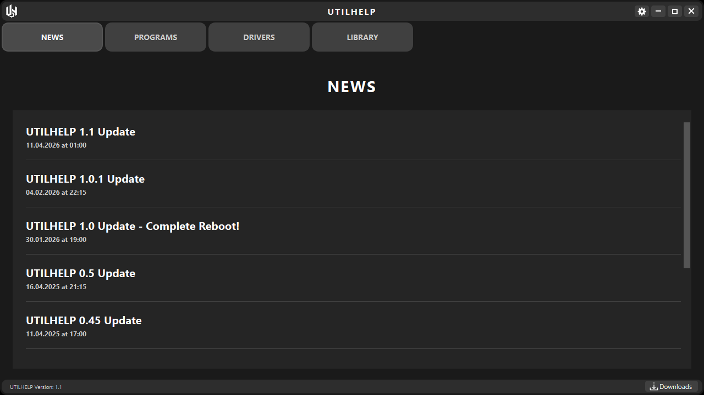
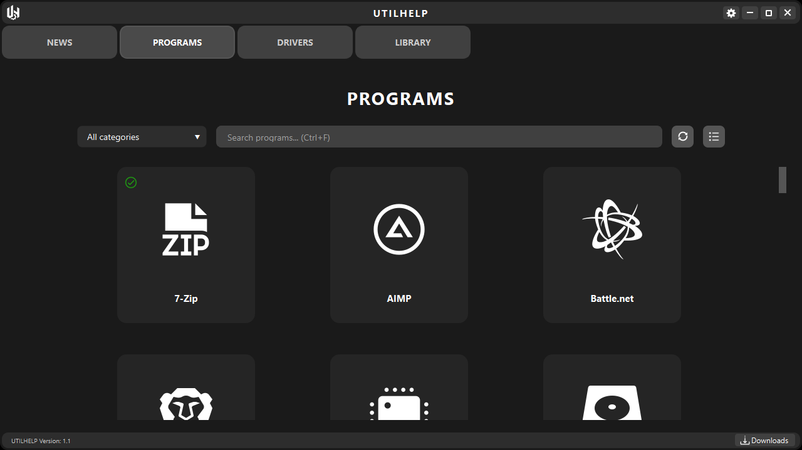
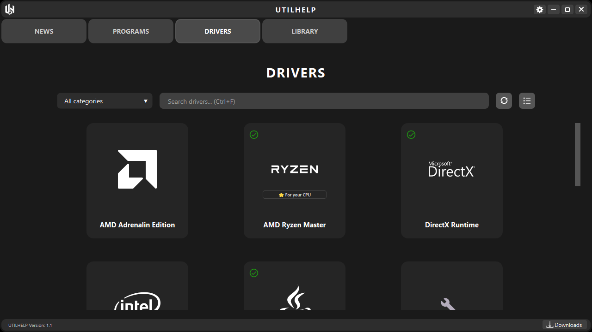
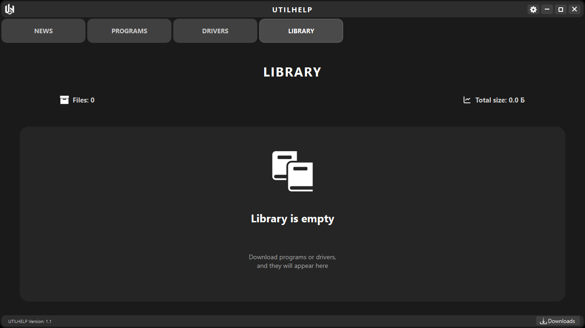
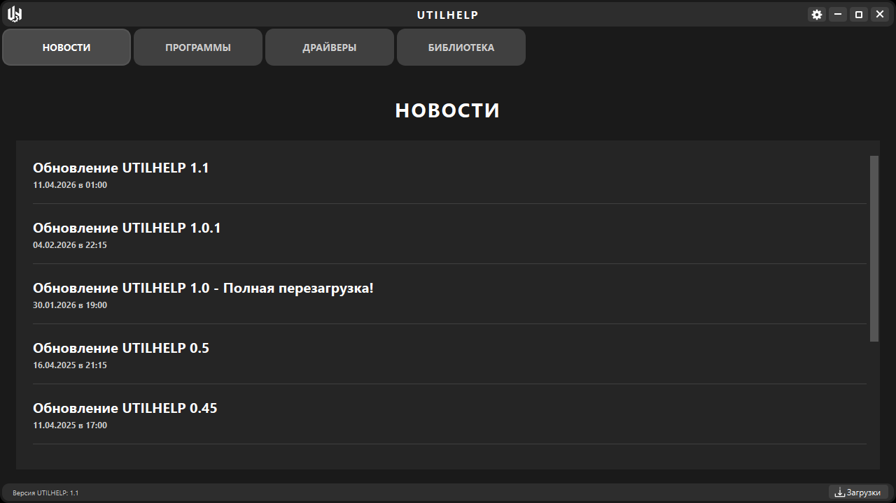
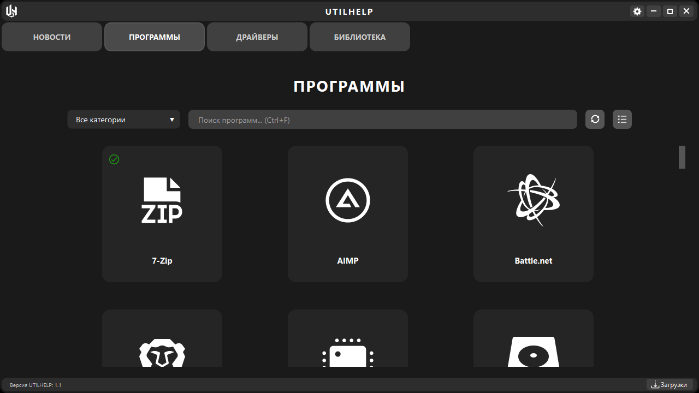
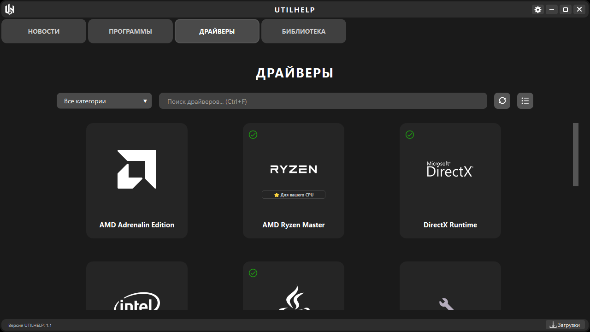
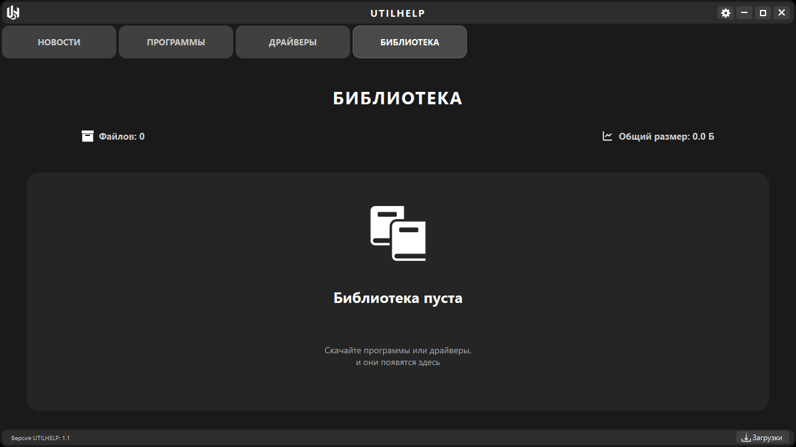

# 🛠️ UTILHELP

<div align="center">


**Universal Windows Assistant**

*Convenient program for downloading popular software, drivers and utilities*

[](https://www.microsoft.com/windows)
[](https://www.python.org/)
[](https://www.qt.io/)
[](LICENSE)

[](https://github.com/al1ster13/UTILHELP/releases)
[](https://github.com/al1ster13/UTILHELP/stargazers)
[](https://github.com/al1ster13/UTILHELP/issues)

[📥 Download Latest](../../releases/latest) • [📖 Documentation](../../wiki) • [🐛 Report Bug](../../issues/new?template=bug_report.md) • [💡 Request Feature](../../issues/new?template=feature_request.md)

---

### 🌐 Language / Язык

**[English](#english)** | **[Русский](#русский)**

</div>

---

<a name="english"></a>
# English

## 🌟 Key Features

<table>
<tr>
<td width="50%">

### 📦 **Program Manager**
- 🎯 **24+ popular programs** ready to download
- 🚀 **Fast downloads** from official websites  
- 🎨 **Beautiful icons** for each program
- ✅ **Automatic scanning** of installed software
- ♥ **Favorites system** for frequently used programs

### 🔧 **Driver Manager**  
- 🎮 **GPU drivers**: NVIDIA GeForce, AMD Adrenalin
- 🖥️ **CPU drivers**: Intel Assistant, AMD Ryzen Master
- 📚 **System libraries**: DirectX, .NET, Visual C++, Java
- 🔍 **Smart detection** of installed drivers
- ⚡ **Background scanning** every 30 minutes

</td>
<td width="50%">

### 📰 **Project News**
- 📋 **Update history** of UTILHELP
- 📝 **Changelog** of all versions 
- ✨ **Information about new features**
- 🎯 **Development roadmap**

### 📚 **Download Library**
- 💾 **File management** in UHDOWNLOAD folder
- 🚀 **Quick launch** installers with one click
- 📊 **Statistics** - size and number of files
- 🗑️ **Easy deletion** of unnecessary downloads
- 🔄 **Automatic moving** from temporary folders

</td>
</tr>
</table>

*All programs and drivers are downloaded from official developer websites*

## 🖼️ Screenshots

<div align="center">

### Main Window


### Program Manager


### Driver Manager  


### Download Library


</div>

---

## ✨ Features

- 🎨 **Modern design** - dark theme with smooth animations
- 🔍 **System scanning** - automatic detection of installed software
- 📊 **JSON settings** - fast settings without database
- 🌐 **Online data** - up-to-date information from GitHub Pages
- 💾 **Smart caching** - offline work after first launch
- 💻 **Intuitive interface** - easy even for beginners
- 🚀 **Fast performance** - optimized PyQt6 code
- 💪 **Security** - downloads only from official sources
- 🔄 **Auto-updates** - check for new versions via GitHub API
- 🌍 **Multi-language** - Russian and English interface

---

## 🛠️ Technologies

- **Python 3.14** - main development language
- **PyQt6** - modern graphical interface
- **Requests** - downloading data from internet
- **JSON** - storing settings and cache
- **Windows Registry** - scanning installed programs
- **PowerShell** - detecting system drivers
- **PyInstaller** - creating executable files
- **Inno Setup** - creating Windows installer
- **GitHub Pages** - database hosting
- **GitHub API** - update checking

---

## 🚀 Quick Start

### Ready Version (Recommended)

1. **Download** the latest version from [Releases](../../releases)
2. **Run the installer** 
3. **Follow** the installer instructions
4. **Done!** The program will appear in the Start menu

### From Source Code

```bash
# Clone the repository
git clone https://github.com/al1ster13/UTILHELP.git
cd UTILHELP

# Install dependencies
pip install -r requirements.txt

# Run the program
python main.py
```

## 🎯 System Requirements

| Component | Minimum | Recommended |
|-----------|---------|-------------|
| **OS** | Windows 10 | Windows 11 |
| **RAM** | 2 GB | 4 GB |
| **Disk Space** | 100 MB | 500 MB |
| **Internet** | Required | Broadband |

---

## 🤝 Contributing

We welcome any contribution to the project!

### How to help:

1. 🌟 **Star the project** - it motivates us to develop
2. 📢 **Report a bug** - create an Issue with problem description
3. 💭 **Suggest an idea** - tell us what can be improved
4. 📝 **Improve documentation** - fix typos or add to README
5. 🔧 **Add functionality** - create a Pull Request with new features

### Pull Request Rules:

- Describe what you changed and why
- Follow the project code style
- Test changes before submitting
- Update documentation if needed

---

## 🌍 Community

### Join Us
- 💬 **Telegram channel**: [@UTILHELP](https://t.me/UTILHELP) - news and updates
- 👥 **Telegram chat**: [@UTILHELP_CHAT](https://t.me/+A0zlJBluI8s5YjMy) - user communication
- 🐙 **GitHub Discussions**: [Discussions](../../discussions) - ideas and suggestions

---

## 📞 Support

### Need Help?

- 📖 **Documentation**: [Wiki](../../wiki)
- 🐛 **Bugs**: [Issues](../../issues)
- 📧 **Email**: utilhelp@yandex.com
- 💬 **Telegram**: [@UTILHELP](https://t.me/UTILHELP)

### FAQ

<details>
<summary><b>Program won't start</b></summary>

1. Make sure you have Windows 10+
2. Add the program to antivirus exceptions
3. Check internet connection for first launch
4. Try running as administrator

</details>

<details>
<summary><b>Installed programs not detected</b></summary>

1. Click the scan button (⟲) to update status
2. Wait for background scanning to complete
3. Portable programs may not be detected
4. Results are cached for 24 hours

</details>

<details>
<summary><b>How to add a new program?</b></summary>

1. Open an Issue with "enhancement" tag
2. Specify program name and official website
3. Attach logo (PNG, 100x100px)
4. Wait for review and addition to database

</details>

---

## 📄 License

This project is distributed under the MIT License. See [LICENSE](LICENSE) for details.

---

## 💖 Support the Project

If UTILHELP helped you save time and simplify your computer work, you can support the project development:

<div align="center">

[](https://www.donationalerts.com/r/al1ster13)

**[💰 Support via DonationAlerts](https://www.donationalerts.com/r/al1ster13)**

</div>

### Why support the project?

- 🚀 **Faster development** - more time for new features
- 🐛 **Quick fixes** - prompt bug elimination  
- ✨ **New features** - implementation of your ideas
- 📚 **Better documentation** - detailed guides
- 🎯 **Developer motivation** - your support inspires work

---

## 🙏 Acknowledgments

Thanks to everyone who helps develop the project:

- All contributors for code contributions
- Users for feedback and suggestions
- Python and PyQt community for great tools

---

<div align="center">

**⭐ Star the project if you liked it!**

Made with ❤️ by [al1ster13](https://github.com/al1ster13)

</div>

---
---

<a name="русский"></a>
<a name="русский"></a>
# Русский
## 🌟 Основные возможности

<table>
<tr>
<td width="50%">

### 📦 **Менеджер программ**
- 🎯 **24+ популярные программы** готовых к загрузке
- 🚀 **Быстрая загрузка** с официальных сайтов  
- 🎨 **Красивые иконки** для каждой программы
- ✅ **Автоматическое сканирование** установленного ПО
- ♥ **Система избранного** для часто используемых программ

### 🔧 **Менеджер драйверов**  
- 🎮 **GPU драйверы**: NVIDIA GeForce, AMD Adrenalin
- 🖥️ **CPU драйверы**: Intel Assistant, AMD Ryzen Master
- 📚 **Системные библиотеки**: DirectX, .NET, Visual C++, Java
- 🔍 **Умное определение** установленных драйверов
- ⚡ **Фоновое сканирование** каждые 30 минут

</td>
<td width="50%">

### 📰 **Новости проекта**
- 📋 **История обновлений** UTILHELP
- 📝 **Changelog** всех версий 
- ✨ **Информация о новых функциях**
- 🎯 **Планы развития** проекта

### 📚 **Библиотека загрузок**
- 💾 **Управление файлами** в папке UHDOWNLOAD
- 🚀 **Быстрый запуск** установщиков одним кликом
- 📊 **Статистика** - размер и количество файлов
- 🗑️ **Удобное удаление** ненужных загрузок
- 🔄 **Автоматическое перемещение** из временных папок

</td>
</tr>
</table>

*Все программы и драйвера загружаются с официальных сайтов разработчиков*

## 🖼️ Скриншоты

<div align="center">

### Главное окно


### Менеджер программ


### Менеджер драйверов  


### Библиотека загрузок


</div>

---

## ✨ Особенности

- 🎨 **Современный дизайн** - темная тема с плавными анимациями
- 🔍 **Системное сканирование** - автоматическое определение установленного ПО
- 📊 **JSON настройки** - быстрые настройки без базы данных
- 🌐 **Онлайн данные** - актуальная информация с GitHub Pages
- 💾 **Умное кэширование** - работа офлайн после первого запуска
- 💻 **Интуитивный интерфейс** - понятно даже новичкам
- 🚀 **Быстрая работа** - оптимизированный код на PyQt6
- 💪 **Безопасность** - загрузка только с официальных источников
- 🔄 **Автообновления** - проверка новых версий через GitHub API
- 🌍 **Мультиязычность** - русский и английский интерфейс

---

## 🛠️ Технологии

- **Python 3.14** - основной язык разработки
- **PyQt6** - современный графический интерфейс
- **Requests** - загрузка данных из интернета
- **JSON** - хранение настроек и кэша
- **Windows Registry** - сканирование установленных программ
- **PowerShell** - определение драйверов системы
- **PyInstaller** - создание исполняемых файлов
- **Inno Setup** - создание установщика Windows
- **GitHub Pages** - хостинг баз данных
- **GitHub API** - проверка обновлений

---

## 🚀 Быстрый старт

### Готовая версия (Рекомендуется)

1. **Скачайте** последнюю версию из [Releases](../../releases)
2. **Запустите установщик** 
3. **Следуйте** инструкциям установщика
4. **Готово!** Программа появится в меню Пуск

### Из исходного кода

```bash
# Клонируйте репозиторий
git clone https://github.com/al1ster13/UTILHELP.git
cd UTILHELP

# Установите зависимости
pip install -r requirements.txt

# Запустите программу
python main.py
```

## 🎯 Системные требования

| Компонент | Минимум | Рекомендуется |
|-----------|---------|---------------|
| **ОС** | Windows 10 | Windows 11 |
| **ОЗУ** | 2 ГБ | 4 ГБ |
| **Место на диске** | 100 МБ | 500 МБ |
| **Интернет** | Требуется | Широкополосный |

---

## 🤝 Вклад в проект

Мы приветствуем любой вклад в развитие проекта!

### Как помочь проекту:

1. 🌟 **Поставьте звезду** - это мотивирует нас развивать проект
2. 📢 **Сообщите об ошибке** - создайте Issue с описанием проблемы
3. 💭 **Предложите идею** - расскажите что можно улучшить
4. 📝 **Улучшите документацию** - исправьте опечатки или дополните README
5. 🔧 **Добавьте функционал** - создайте Pull Request с новыми возможностями

### Правила для Pull Request:

- Опишите что изменили и зачем
- Следуйте стилю кода проекта
- Протестируйте изменения перед отправкой
- Обновите документацию если нужно

---

## 🔧 Разработка

### Сборка установщика

```bash
# Создание исполняемого файла
cd build_scripts
build_final.bat

# Сборка установщика (требует Inno Setup)
build_installer.bat
```

**Структура сборки:**
- Все скрипты сборки находятся в папке `build_scripts/`
- PyInstaller создаёт exe из Python кода
- Inno Setup создаёт установщик Windows
- Автоматическая организация файлов после сборки

---

## 🌍 Сообщество

### Присоединяйтесь к нам
- 💬 **Telegram канал**: [@UTILHELP](https://t.me/UTILHELP) - новости и обновления
- 👥 **Telegram чат**: [@UTILHELP_CHAT](https://t.me/+A0zlJBluI8s5YjMy) - общение с пользователями
- 🐙 **GitHub Discussions**: [Обсуждения](../../discussions) - идеи и предложения

### Как стать частью сообщества
1. ⭐ **Поставьте звезду** проекту
2. 📢 **Расскажите друзьям** о UTILHELP
3. 🐛 **Сообщайте об ошибках** через Issues
4. 💡 **Предлагайте идеи** для улучшения
5. 🔧 **Вносите код** через Pull Requests

---

## 📞 Поддержка

### Нужна помощь?

- 📖 **Документация**: [Wiki](../../wiki)
- 🐛 **Баги**: [Issues](../../issues)
- 📧 **Email**: utilhelp@yandex.com
- 💬 **Telegram**: [@UTILHELP](https://t.me/UTILHELP)

### Часто задаваемые вопросы

<details>
<summary><b>Программа не запускается</b></summary>

1. Убедитесь что у вас Windows 10+
2. Добавьте программу в исключения антивируса
3. Проверьте подключение к интернету для первого запуска
4. Попробуйте запустить от имени администратора

</details>

<details>
<summary><b>Не определяются установленные программы</b></summary>

1. Нажмите кнопку сканирования (⟲) для обновления статуса
2. Подождите завершения фонового сканирования
3. Портативные программы могут не определяться
4. Результаты кэшируются на 24 часа

</details>

<details>
<summary><b>Как добавить новую программу?</b></summary>

1. Откройте Issue с тегом "enhancement"
2. Укажите название программы и официальный сайт
3. Приложите логотип (PNG, 100x100px)
4. Дождитесь рассмотрения и добавления в базу данных

</details>

<details>
<summary><b>Где хранятся скачанные файлы?</b></summary>

1. Все файлы сохраняются в папку UHDOWNLOAD
2. Путь можно увидеть на вкладке "Библиотека"
3. Файлы автоматически перемещаются из временных папок
4. Можно запускать установщики прямо из библиотеки

</details>

<details>
<summary><b>Как работает автообновление?</b></summary>

1. Программа проверяет обновления при запуске через GitHub API
2. При наличии новой версии показывается уведомление
3. Можно проверить вручную в Настройки → Обновления
4. Скачивание и установка происходят вручную

</details>

<details>
<summary><b>Можно ли использовать без интернета?</b></summary>

1. Первый запуск требует интернет для загрузки баз данных
2. После этого программа работает офлайн с кэшированными данными
3. Сканирование системы работает полностью офлайн
4. Загрузка новых файлов требует постоянного интернета

</details>

---

## 🔧 Устранение неполадок

### Частые проблемы и решения

| Проблема | Причина | Решение |
|----------|---------|---------|
| Не запускается | Блокировка антивируса | Добавьте в исключения антивируса |
| Медленное сканирование | Антивирус замедляет | Временно отключите антивирус |
| Не определяются программы | Устаревший кэш | Нажмите кнопку сканирования (⟲) |
| Не сохраняются настройки | Защита папки | Запустите от имени администратора |
| Ошибка загрузки данных | Нет интернета | Проверьте подключение к интернету |

---

## 📄 Лицензия

Этот проект распространяется под лицензией MIT. Подробности в файле [LICENSE](LICENSE).

```
MIT License

Copyright (c) 2026 al1ster13

Permission is hereby granted, free of charge, to any person obtaining a copy
of this software and associated documentation files (the "Software"), to deal
in the Software without restriction, including without limitation the rights
to use, copy, modify, merge, publish, distribute, sublicense, and/or sell
copies of the Software...
```

---

## ⚠️ Дисклеймер

UTILHELP является агрегатором ссылок на официальные сайты разработчиков программного обеспечения. Мы не распространяем и не модифицируем программы - все загрузки происходят напрямую с официальных источников. Мы не несем ответственности за работу сторонних программ и драйверов.

---

## 💖 Поддержка проекта

Если UTILHELP помог вам сэкономить время и упростить работу с компьютером, вы можете поддержать разработку проекта:

<div align="center">

[](https://www.donationalerts.com/r/al1ster13)

**[💰 Поддержать через DonationAlerts](https://www.donationalerts.com/r/al1ster13)**

</div>

### Зачем поддерживать проект?

- 🚀 **Ускорение разработки** - больше времени на новые функции
- 🐛 **Быстрые исправления** - оперативное устранение багов  
- ✨ **Новые возможности** - реализация ваших идей и предложений
- 📚 **Лучшая документация** - подробные гайды и инструкции
- 🎯 **Мотивация разработчика** - ваша поддержка вдохновляет на работу

### Другие способы поддержки:

- ⭐ **Поставьте звезду** проекту на GitHub
- 📢 **Расскажите друзьям** о UTILHELP
- 🐛 **Сообщайте об ошибках** и предлагайте улучшения
- 📝 **Помогите с документацией** и переводами
- 💻 **Внесите код** через Pull Request

*Любая поддержка важна и помогает проекту развиваться!*

---

## 🙏 Благодарности

Спасибо всем, кто помогает развивать проект:

- Всем контрибьюторам за вклад в код
- Пользователям за отзывы и предложения
- Сообществу Python и PyQt за отличные инструменты

---

<div align="center">

**⭐ Поставьте звезду, если проект вам понравился!**

Made with ❤️ by [al1ster13](https://github.com/al1ster13)

</div>
